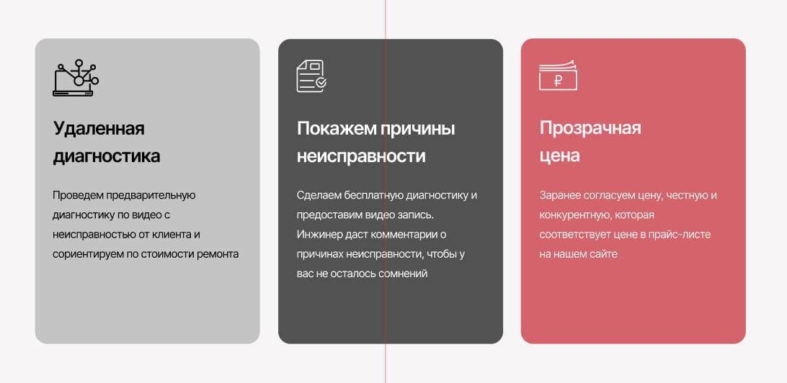
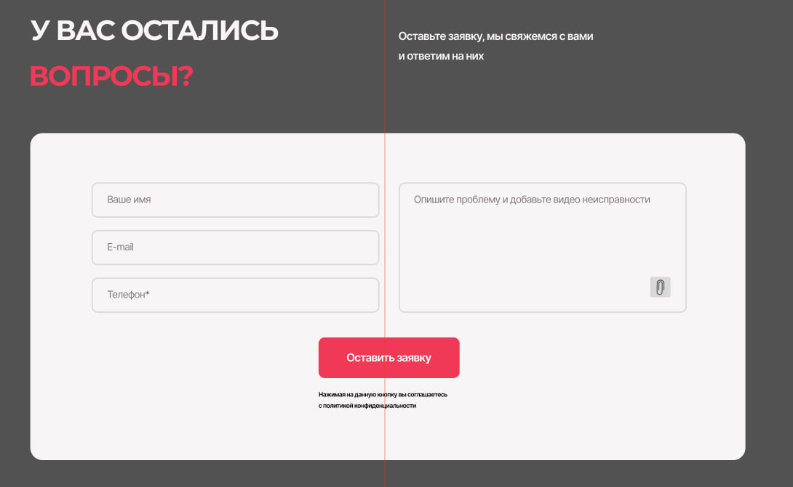

# BEM
 Github Branching Workout

## Человеческое тело BEM

### Голова
```
.голова

.голова__глаз
.голова__нос
.голова__губы

.голова__глаз--линза_черная
.голова__нос--пирсинг
.голова__губы--помада_красная
```
### Рука

```
.рука

.рука__локоть
.рука__палец
.рука__кисть

.рука__локоть--с_раной
.рука__палец--ногти_красные
```
### Тело

```
.тело

.тело__грудь

.тело__грудь--татуировка
```

## BEM на примере проекта. Вариант 10


```
header.header>(a.header__logo.logo>img.logo__img)+(nav.header__navigation.navigation>a.navigation__link)+p.header__contact
```


```
section.advantages>ul.advantages__list>li.advantages__item*3>img.advantages__icon+h2.advantages__title+p.advantages__description
```



```
section.feedback>form.feedback__form.form>(label.form__shell>input.input__input)*4+input.form__submit+p.form__notice
```


```
footer.footer>div.wrapper>(a.footer__logo.logo>img.logo__img)+(ul.footer__list*3>li.footer__item*3>a.footer__link)
```
